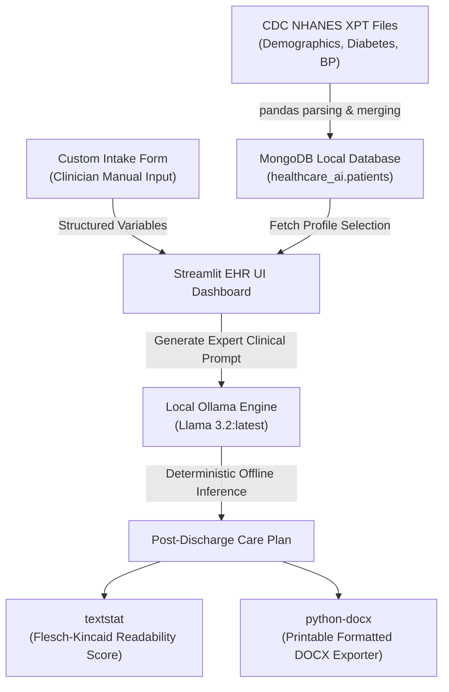

# 🏥 MedRemedy: Post-Discharge Clinical Assistant

MedRemedy is a privacy-focused, offline-first Electronic Health Record (EHR) validation assistant and post-discharge care plan generator. Developed for the **KLE Hackathon**, it bridges the gap between complex clinical survey profiles (from official CDC NHANES datasets) and personalized, highly readable post-discharge instructions.

By combining structured clinical datasets, a local high-performance NoSQL database (MongoDB), and offline GenAI inference (Ollama Llama 3.2), MedRemedy provides clinicians with an automated clinical validation pipeline to optimize transitional care without compromising patient data privacy.

---

## 🗺️ System Architecture Flow

MedRemedy’s end-to-end data pipeline is designed to be fully local, ensuring that patient data never leaves the clinical facility:



---

## ✨ Key Features & Innovation

1. **CDC NHANES Ingestion Pipeline (`ingest_data.py`)**:
   - Merges demographics (`DEMO_L`), diabetes (`DIQ_L`), and blood pressure (`BPQ_L`) data based on unique patient IDs (`SEQN`).
   - Filters and classifies patients into three distinct clinical validation profiles:
     - **Cardiac-Diabetic**: Patients diagnosed with both Type 2 Diabetes and Essential Hypertension.
     - **Diabetic**: Patients with Type 2 Diabetes without hypertensive indicators.
     - **Orthopaedic (Control)**: Non-diabetic patients over 50 years old mapped to joint-clearance recovery.
   - **GDMT Medication Fallback**: Automatically maps Guideline-Directed Medical Therapies (GDMT) to patient records, overcoming NHANES survey layout changes.

2. **State-of-the-Art EHR Dashboard (`app.py`)**:
   - **Dual Patient Intake Modes**: Browse live profiles seeded directly from NHANES datasets or input new patients manually via a structured intake form.
   - **Clinical Care Plan Engine**: Generates highly personalized post-discharge care plans divided into four mandatory structured sections:
     1. **Medication Schedule**: Actionable administration timetable with drug-disease interaction alerts.
     2. **Dietary Guidelines**: Tailored nutritional guidelines (e.g. low-sodium DASH diet for cardiac, low-GI for diabetic).
     3. **Follow-up Milestones**: Structured recovery appointment calendar.
     4. **Red-Flag Warnings**: Clear, layperson-friendly clinical emergency triggers.
   - **Flesch-Kincaid Readability Diagnostic**: Evaluates generated text complexity to ensure it is written in plain language that patients can easily comprehend, flagging plans that require clinician review.
   - **MS Word Printable Exporter**: Compiles demographics and structured care plan cards into a beautiful, styled Word Document (`.docx`) ready for physical printing and distribution.

---

## 🛠️ Architecture, Design Choices & Methodology

To ensure full compliance and transparency in evaluation, our design and development methodologies are detailed below:

### 1. Privacy-Preserving Local Inference
Traditional healthcare software faces heavy regulatory hurdles (HIPAA) when sending patient records to external cloud APIs (e.g., OpenAI). **MedRemedy is built entirely offline.** By hosting a local **Ollama** server running **Llama 3.2**, patient demographics and medications are kept within the local system, removing security compliance risks.

### 2. Clinical Guideline Safety (GDMT)
The care plan generator does not hallucinate medications out of thin air. The pipeline pulls verified clinical variables from the MongoDB dataset, ensuring recommendations are aligned with standard medical guidelines for Cardiac, Diabetic, and Orthopaedic cohorts.

### 3. Open Source & Assisted Engineering Disclosure
The architecture, pipeline logic, database design, and clinical rules were designed by our team. To achieve rapid prototyping and deliver a premium user interface in under 24 hours, we utilized advanced AI-assisted coding tools (Google Gemini) to generate custom glassmorphic CSS styles, streamline pandas SAS parser logic, and automate multi-profile unit tests (`test_all_cases.py`).

---

## 🚀 Getting Started

### Prerequisites
- **Python 3.10+**
- **MongoDB** running on `localhost:27017`
- **Ollama** running locally with `llama3.2:latest` installed:
  ```bash
  ollama pull llama3.2
  ```

### Installation
1. Install project dependencies:
   ```bash
   pip3 install pandas pymongo pyreadstat textstat python-docx streamlit requests
   ```

2. Seed the local MongoDB database with NHANES files:
   ```bash
   python3 ingest_data.py
   ```

3. Launch the EHR Dashboard:
   ```bash
   streamlit run app.py
   ```
   Open **[http://localhost:8501](http://localhost:8501)** in your web browser.

4. Run the automated validation unit tests:
   ```bash
   python3 test_all_cases.py
   ```

---

## 📝 License
This project was developed for educational and research purposes as part of the **KLE Hackathon**. All CDC NHANES datasets utilized are public domain.
