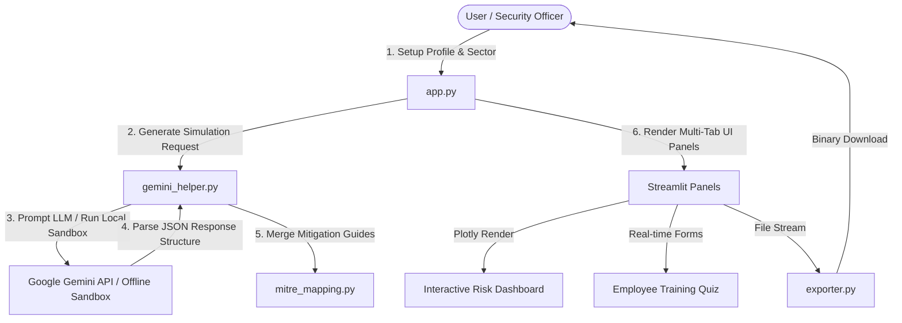

# CyberShield Sandbox: Social Engineering Simulation & Employee Awareness Platform

A GenAI-powered defense platform built for cybersecurity awareness training. It generates realistic, department-specific social engineering attack simulations (Vishing, Smishing, Pretexting), highlights active manipulation tactics, scores threats, maps activities to the MITRE ATT&CK matrix, provides quizzes, and exports PDF/DOCX compliance briefs.

---

## 🛡️ Important Safety & Defensive Compliance
- **Defensive Scope Only:** This application is strictly designed for cybersecurity training and defense awareness.
- **No Attack Tooling:** The platform does not generate executable payloads, exploitation scripts, or real phishing server templates.
- **Training Labels:** Every simulated dialogue, email, and SMS is prepended with the prominent safety tag: `[TRAINING SIMULATION ONLY]`.

---

## 🛠️ Project Architecture Diagram



---

## 📂 Folder Structure

```
c:/Users/Victus/Documents/genaihackathon/
├── app.py                      # Streamlit Main Dashboard, Custom Styling, Interactive Forms & Tabs
├── gemini_helper.py            # LLM Prompts, API Configuration & Pre-seeded Offline Sandbox Scenarios
├── mitre_mapping.py            # Local MITRE ATT&CK Database mapping & defense logic
├── exporter.py                 # Report builders (docx, reportlab PDF) returning in-memory binary streams
├── requirements.txt            # Package configuration
└── README.md                   # Complete system manual, PPT Pitch Deck structure, and Demo Script
```

---

## 📝 Prompt Engineering Templates

The application uses Gemini 1.5 Flash to generate JSON responses. The template forces the model to act as a defensive cybersecurity analyst:

```
You are an expert cybersecurity awareness trainer and social engineering analyst.
Your job is to generate a realistic, high-quality, and highly educational training simulation.

=== CONSTRAINTS ===
- DO NOT generate real instructions on how to perform an attack.
- The output MUST serve purely educational purposes to train employees.
- EVERY output script or message MUST contain the label "[TRAINING SIMULATION ONLY]".
- Output MUST be structured JSON matching the schema.

=== PARAMETERS ===
- Sector: {sector}
- Target Department: {department}
- Employee Role: {employee_role}
- Social Engineering Attack Type: {attack_type}
- Context/Scenario: {scenario_description}
```

---

## ⛓️ MITRE ATT&CK & Threat Scoring Logic

### MITRE ATT&CK Mapping
Simulations are mapped to standard ATT&CK techniques:
- **T1566.003 (Spearphishing Voice):** Voice calls (Vishing) targeting dynamic actions or credentials.
- **T1566.002 (Spearphishing Link):** Sending SMS messages (Smishing) containing external login domains.
- **T1598 (Phishing for Information):** Posing as executives or vendors to acquire internal structural details.

### Threat Scoring Metrics
- **Risk Score (0-100):** Determined by evaluating:
  - *Sophistication of Pretext:* (0-40) - Use of valid partner details, names, or reference numbers.
  - *Emotional Cues:* (0-30) - Level of Urgency, Fear, or Authority pressure.
  - *Technical Action:* (0-30) - Requesting MFA tokens, direct wires, or downloading software.
- **Likelihood:** Low, Medium, High, or Critical.
- **Impact:** Financial Loss, Credential Leak, or Operational Interruption.

---

## 🎨 PPT Pitch Deck Structure (10 Slides)

### Slide 1: Title Slide
* **Title:** CyberShield: Scaling Social Engineering Resistance with GenAI
* **Subtitle:** An Adaptive Sandbox for Context-Aware Defensive Training
* **Details:** Hackathon Team Details, Date, and Defensive Target.

### Slide 2: The Social Engineering Crisis
* **Problem:** 82% of data breaches involve a human element (Verizon DBIR). Conventional generic training fails because attacks are highly customized to the employee’s sector, department, and role.
* **Tactic Focus:** Vishing, Smishing, and Pretexting are on the rise, exploiting Authority, Urgency, and Fear.

### Slide 3: The CyberShield Solution
* **Product Concept:** An on-demand sandbox that leverages GenAI to generate hyper-realistic, role-specific defensive simulations, analyzes manipulation tactics, and reinforces learning with real-time interactive testing.

### Slide 4: Target Sectors & Department Workloads
* **Flexibility:** Tailored scenarios for Technology, Finance, Healthcare, Retail, Government, and Education.
* **Role Specificity:** Customizing simulations for Helpdesk Specialists, HR leads, and Account Managers to reflect their day-to-day threat landscape.

### Slide 5: Core Technical Features
1. **Simulation Arena:** Real-time generation with inline highlighting of manipulation cues.
2. **Threat Intelligence Engine:** Real-time risk grading and MITRE ATT&CK mapping.
3. **Validation Suite:** Dynamically created MCQs and scenario tests.
4. **Enterprise Dashboard:** Executive dashboard tracking department-wise readiness.

### Slide 6: System Architecture & Safety Guardrails
* **Architecture:** Streamlit frontend connecting to Google Gemini API with fallback to an offline Sandbox Demo mode (ensures 100% demo stability).
* **Defensive Guardrails:** Strictly defensive output, non-exploitable scripts, and mandatory training warning labels.

### Slide 7: Gemini API Prompt Engineering
* **Structured JSON Output:** Enforcing `response_mime_type="application/json"` with schema constraints to retrieve structured data in a single round-trip, optimizing cost and latency.

### Slide 8: Enterprise Integration & Compliance Exports
* **Logistics:** One-click downloads of DOCX and PDF compliance logs. Suitable for employee training records, compliance auditing (ISO 27001, SOC2), and security briefings.

### Slide 9: Market Potential & Future Roadmap
* **Roadmap:**
  - Automated LMS integrations (SCORM/xAPI).
  - Voice synthesizer API integration for live mock phone call evaluations.
  - Interactive email sandbox mock runs.

### Slide 10: Summary & Vision
* **Closing:** Empowering employees to recognize the psychological triggers behind manipulation.
* **Call to Action:** Let's secure the human layer. Open for Q&A.

---

## 🎤 3-Minute Demo Pitch Script

### [0:00 - 0:45] Hook & Problem Statement
> "Good afternoon, judges. 82% of corporate cyber breaches don't start with a software bug—they start with a conversation. Attackers impersonate IT administrators, HR managers, or CEOs, using voice, text, and email. While hackers use AI to craft highly targeted social engineering campaigns, most corporate training is still generic, boring, and ineffective. 
> 
> Today, we present **CyberShield Sandbox**—an intelligent, adaptive simulation platform that turns GenAI into a defensive shield. It allows security teams to create hyper-localized training scenarios tailored to an employee's exact sector, department, and role in seconds."

### [0:45 - 1:45] Live App Demonstration (Simulations)
> "Let’s look at the application. On the left sidebar, we have our platform controls. Because hackathon environments demand reliability, we have built a **Sandbox Demo Mode** that allows testing the app's full logic with zero configuration.
> 
> Let's run a demo. I will click **IT Helpdesk Demo**. Instantly, the platform loads a vishing simulation. In the **Simulation Arena**, you see the dialogue. What makes this special is our **inline highlight compiler**. We automatically highlight active manipulation tactics in red. If we hover over them, we see the exact tactic—like 'Impersonation' when claiming to be Marcus from IT, or 'Urgency' when threatening account lockouts.
> 
> Next to the script, our **Threat Intelligence Module** calculates a Risk Score of 88, maps it to MITRE ATT&CK Techniques like Spearphishing Voice, and gives mitigation advice."

### [1:45 - 2:30] Interactive Quiz & Analytics
> "Under the **Awareness & Quiz** tab, employees are presented with targeted red flags, Do's, and Don'ts, alongside a dynamically generated quiz. Let's answer one of the questions: 'Why is sharing an MFA code dangerous?' If we select the correct option and submit, the system validates the score, giving immediate feedback and explaining the adversary's logic.
> 
> To demonstrate corporate readiness, our **Enterprise Ready Dashboard** aggregates past simulations. Executive judges can quickly review which departments are most vulnerable, track historical monthly reporting improvements, and see which psychological triggers—like Urgency or Authority—are tricking their team."

### [2:30 - 3:00] Exporter & Conclusion
> "Finally, under **Report Exporter**, security leads can download complete PDF and Word briefing documents generated in-memory. 
> 
> CyberShield takes social engineering training from passive videos to an active, measurable testing center. By using Google Gemini to automate scenario creation, we can keep up with the speed of modern attackers and turn employees from vulnerabilities into our strongest firewall. Thank you."
